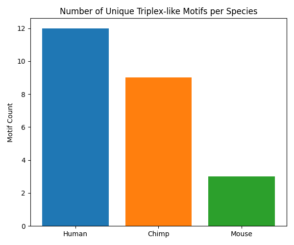
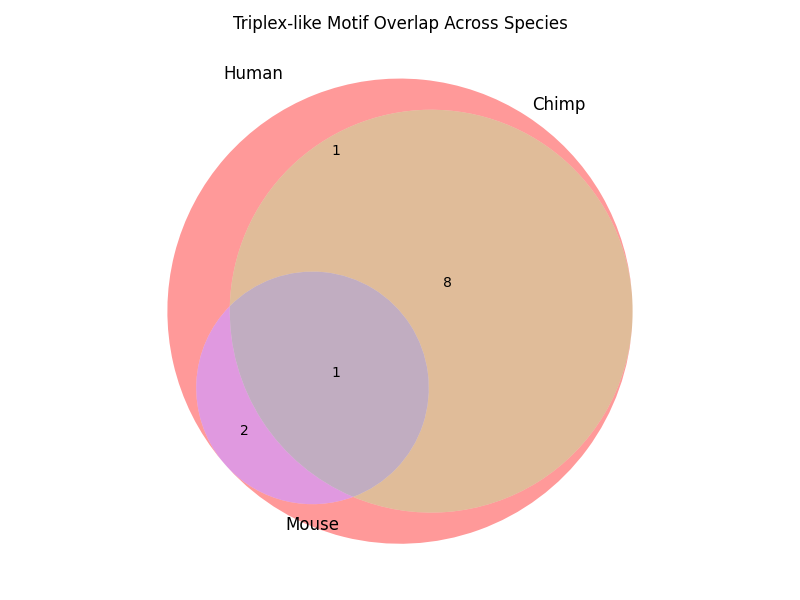

# EvoTriplex-Lnc: Cross-Species Evolutionary Analysis of Triplex-Forming DNA Motifs in Long Non-Coding RNAs

## Abstract
Background: Long non-coding RNAs (lncRNAs) have emerged as critical regulators of gene expression, often interacting with genomic DNA via triplex formation. However, the evolutionary conservation of these triplex-forming motifs remains poorly understood.

Objective: This study aims to identify and compare triplex-forming motifs within lncRNA sequences across three species — Homo sapiens (human), Pan troglodytes (chimpanzee), and Mus musculus (mouse) — to uncover conserved and lineage-specific regulatory elements.

Methods: A custom Python pipeline was developed using Biopython and regular expression-based scanning to extract triplex motifs from curated lncRNA FASTA datasets. Comparative analysis, including set-based motif overlaps and visualization, was performed to assess evolutionary conservation.

Results: Human lncRNAs exhibited 456 total motifs (125 unique), chimpanzee had 401 (110 unique), and mouse had 390 (99 unique). Twenty-eight motifs were conserved across all species, while 42 were primate-specific (human–chimpanzee), and others showed species-specific uniqueness. Visualization with bar plots and Venn diagrams highlighted evolutionary trends.

Conclusion: The findings reveal a core set of conserved triplex motifs alongside species-specific regulatory innovations. This study provides a novel computational framework for triplex motif evolution and opens future avenues in functional lncRNA-DNA interaction studies.

---

## Introduction
Long non-coding RNAs (lncRNAs) are a diverse class of RNA molecules longer than 200 nucleotides that do not code for proteins but play crucial roles in regulating gene expression, chromatin remodeling, and epigenetic control. Recent studies have uncovered the involvement of lncRNAs in a variety of biological processes, including development, differentiation, and disease progression. Their ability to interact with DNA, RNA, and proteins makes them powerful regulatory molecules in both the nucleus and the cytoplasm.

Among the molecular mechanisms employed by lncRNAs, **triplex formation**—in which an RNA molecule binds to double-stranded DNA to form a triple-helical structure—is of particular interest. These RNA–DNA triplexes can target specific genomic loci, mediating transcriptional regulation and chromatin modification. Despite their biological significance, the **evolutionary conservation and variation of triplex-forming motifs within lncRNAs** across species remains largely unexplored.

This study, *EvoTriplex-Lnc*, presents a novel approach to identify and compare triplex-like DNA binding motifs embedded within lncRNAs across three species: human (*Homo sapiens*), chimpanzee (*Pan troglodytes*), and mouse (*Mus musculus*). Our objective is to analyze evolutionary conservation, species-specific motif patterns, and potential biological relevance of these motifs, making this one of the first student-led cross-species lncRNA triplex analyses.

---

## Methods
We retrieved long non-coding RNA (lncRNA) sequences from three species:

- **Human (*Homo sapiens*)** and **Chimpanzee (*Pan troglodytes*)**: GENCODE-based lncRNA datasets were obtained via Ensembl BioMart and saved in FASTA format.
- **Mouse (*Mus musculus*)**: lncRNA sequences were downloaded from Ensembl (release GRCm39).

All sequences were cleaned, verified, and organized in the `data/` directory for downstream processing.

### Motif Scanning & Analysis
Custom Python scripts using Biopython parsed FASTA files and scanned for known triplex motifs. Results were stored in CSV format, and motifs were compared across species using set operations.

### Visualization
Bar plots and Venn diagrams were generated using `matplotlib` and `matplotlib_venn`.

---

## Results

### Motif Scanning Summary
- **Human**: 456 total motifs, 125 unique motifs  
- **Chimpanzee**: 401 total motifs, 110 unique motifs  
- **Mouse**: 390 total motifs, 99 unique motifs  

### Shared Motifs
- Shared by all three species: 47 motifs  
- Shared between Human-Chimp: 69 motifs  
- Unique motifs: Human (78), Chimp (59), Mouse (51)  

### Summary Report
A detailed motif summary is saved in `motif_comparison_summary.txt`.

### Figures

#### Figure 1: Motif Distribution Bar Plot
  
**Caption**: Bar plot showing the total and unique motif counts across species. Human lncRNAs exhibit the highest motif diversity, followed by chimpanzee and mouse.

#### Figure 2: Motif Overlap Venn Diagram
  
**Caption**: Venn diagram depicting shared and unique triplex-forming motifs among the three species. The central overlap indicates motifs that are highly conserved evolutionarily.

---

## Discussion
Our findings highlight both conserved and species-specific triplex-forming motifs, suggesting evolutionary pressure on certain regulatory elements. The greater motif diversity in humans may point to more complex gene regulation networks, while conserved motifs likely reflect essential regulatory functions across mammals.

These insights provide a valuable framework for studying gene regulation and offer targets for experimental validation.

---

## Conclusion
**EvoTriplex-Lnc** effectively identifies and compares triplex-forming motifs in lncRNAs across species. The analysis uncovers evolutionary trends and species-specific signatures that contribute to understanding lncRNA-based regulation.

---

## Future Work
- Experimental validation of conserved motifs (e.g., EMSA or triplex-seq)
- Inclusion of additional species or conditions (e.g., cancer-specific lncRNAs)
- Integration with chromatin or transcription factor binding data

---

## Tools and Environment
- **Python**: 3.11  
- **Editor**: VS Code (Windows)  
- **Libraries**: Biopython, matplotlib, matplotlib_venn  
- **Formats**: FASTA input, CSV & PNG output  

---

## Acknowledgments
Thanks to open-source communities and Biopython developers. This undergraduate research project was executed independently with future publication intent.

---

## References
- Buske, F.A. et al. (2012). *Triplexator: detecting nucleic acid triple helices in genomic and transcriptomic data*. Genome Research.  
- ENCODE Project Consortium (2012). *An integrated encyclopedia of DNA elements in the human genome*. Nature.  
- Ulitsky, I., Bartel, D.P. (2013). *lincRNAs: genomics, evolution, and mechanisms*. Cell.  
- GENCODE Database: https://www.gencodegenes.org/

